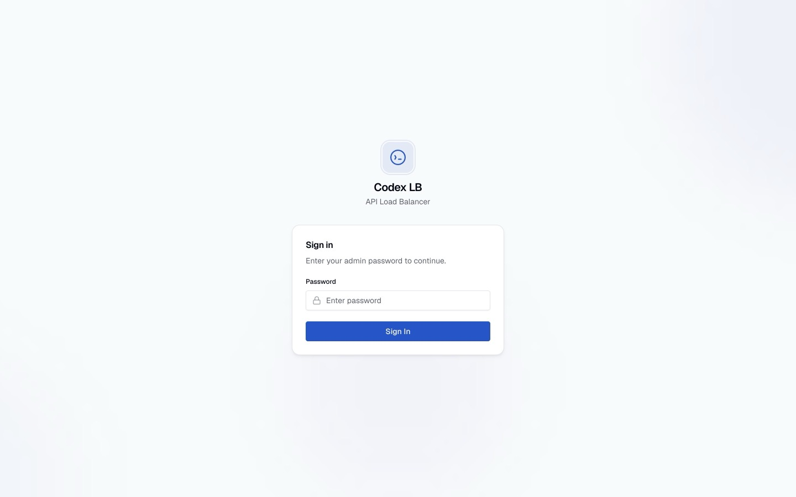
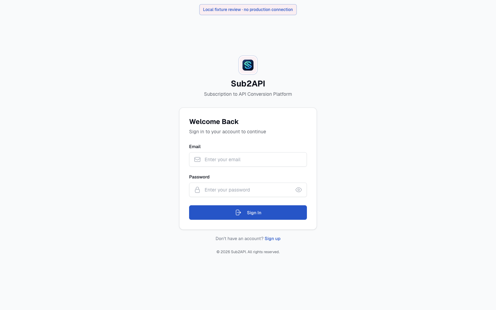
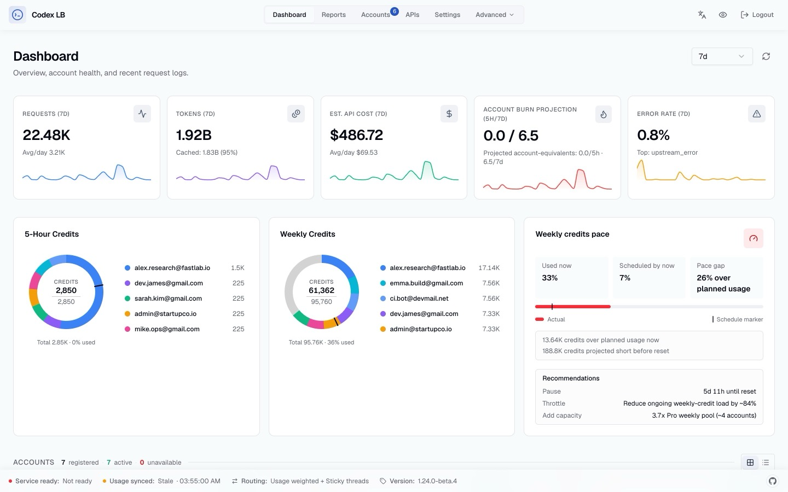
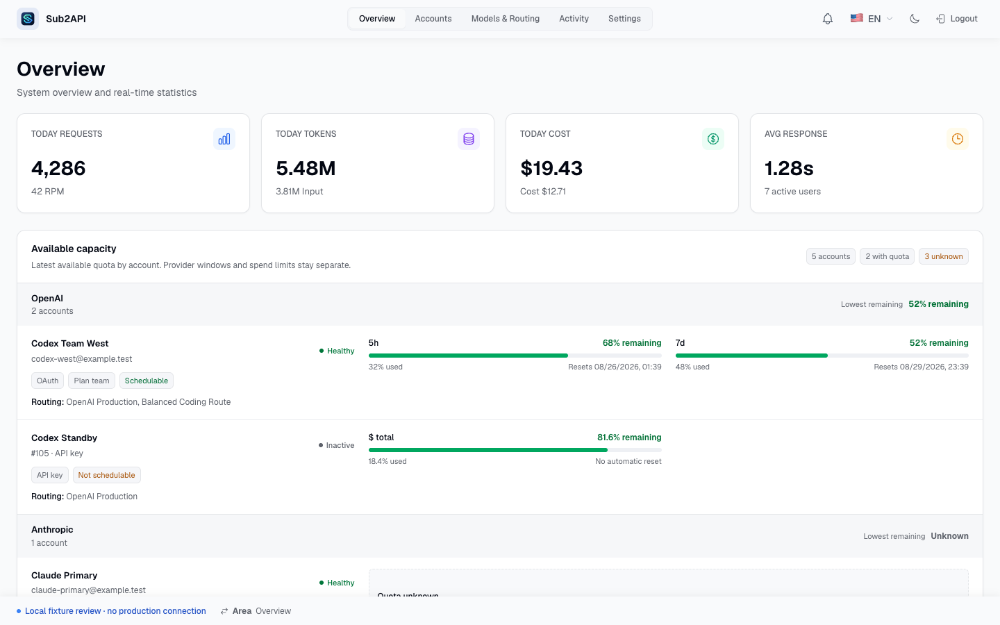
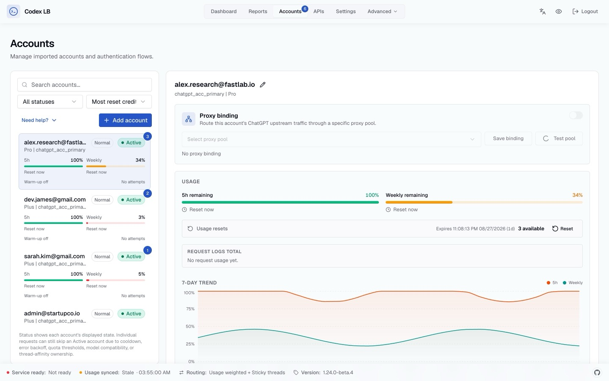
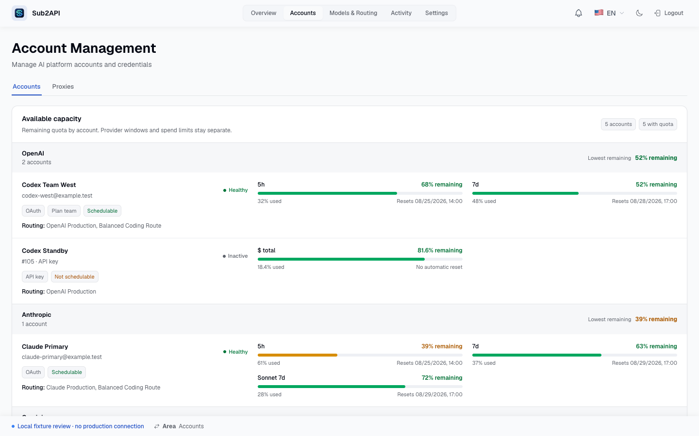
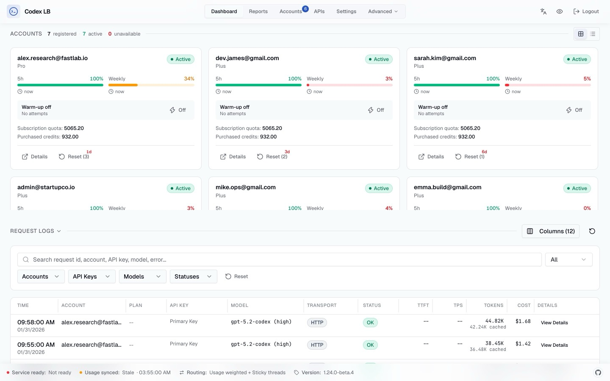
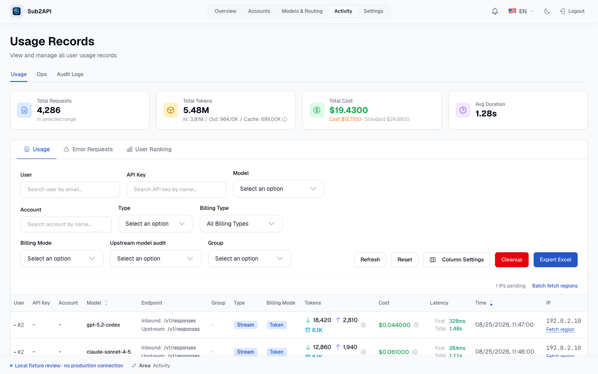
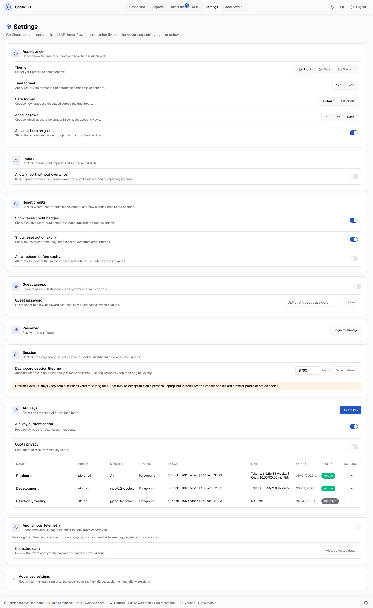
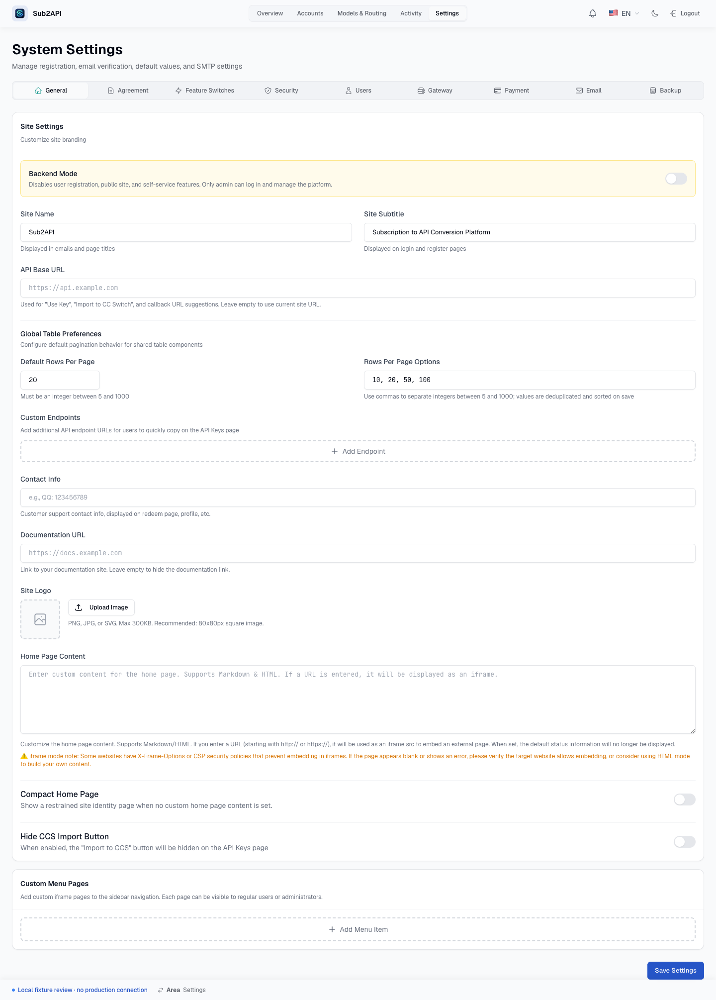

# codex-lb fidelity comparison

Reference source: [`Soju06/codex-lb`](https://github.com/Soju06/codex-lb) at `cedc05f95a46fe062eaf8ff35eceea1a91735a2a`.

The reference images were generated from codex-lb's own synthetic Playwright fixtures. The Sub2API images were generated from `pnpm review:ui`, which serves localhost-only synthetic data and blocks normal writes. Desktop captures use a `1440x900` viewport. Settings uses a full-page capture. The Activity reference scrolls codex-lb's fixture-backed Request Logs section into the viewport.

`frontend/e2e/operator-navigation.spec.ts` repeats the five Sub2API pages at `1440x900`, `1280x800`, `1024x768`, and `768x900` and checks document overflow. The same suite covers the narrow navigation drawer, Settings scrolling, and dialog focus behavior.

## Login

| codex-lb reference | Sub2API fidelity port |
| --- | --- |
|  |  |

## Overview

| codex-lb reference | Sub2API fidelity port |
| --- | --- |
|  |  |

## Accounts

| codex-lb reference | Sub2API fidelity port |
| --- | --- |
|  |  |

## Activity

| codex-lb reference | Sub2API fidelity port |
| --- | --- |
|  |  |

## Settings

| codex-lb reference | Sub2API fidelity port |
| --- | --- |
|  |  |
